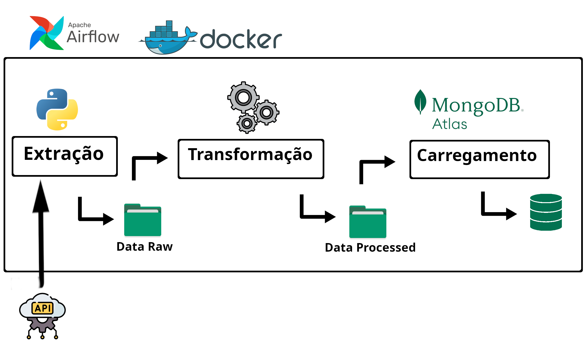

<div align="left">
    <a href="https://airflow.apache.org/" target="_blank"></a>
    <a href="https://www.mongodb.com/" target="_blank"></a>
</div>


# ETL de dados visualcrossing / weather-api


Este repositório apresenta um projeto próprio de um pipeline de dados da [weather-api](https://www.visualcrossing.com/weather-api). O objetivo é configurar uma instância do Airflow com Docker, extrair dados brutos da [weather-api](https://www.visualcrossing.com/weather-api) usando uma conta pessoal, obter informações climáticas de uma cidade específica e, por fim, carregar o conjunto de dados final no [MongoDB Atlas](https://cloud.mongodb.com). O intuito é praticar habilidades de engenharia de dados, como consumo de API, programação de contêineres e agendamento/orquestração de tarefas.



## Requisitos
- Python
- Docker
- Conta na [weather-api](https://www.visualcrossing.com/weather-api)
- Conta no [MongoDB Atlas](https://cloud.mongodb.com)

## Árvore de pastas
```
|-- config
|-- dags
    |-- weather
        |-- custom_dags
            -- dags --
        |-- etl
            -- etl scripts --
|-- data
    |-- raw
        -- city path --
    |-- processed
        -- city path --
|-- img
|-- logs
|-- plugins
-- setup scripts --

```

## Environment
Variávei de ambiente do arquivo `.env`:
| Variáveis | Descrição |
| ----- | ----------- |
| AIRFLOW_UID | Airflow user id |
| CITY | Cidade parâmetro da [weather-api](https://www.visualcrossing.com/weather-api) |
| KEY | Chave parâmetro da [weather-api](https://www.visualcrossing.com/weather-api) |
| URI | String de conexão do [MongoDB Atlas](https://cloud.mongodb.com) |
| DTBASE | Banco de dados existente no [MongoDB Atlas](https://cloud.mongodb.com) |
| COLLECTION | Coleção de dados existente no [MongoDB Atlas](https://cloud.mongodb.com) |
